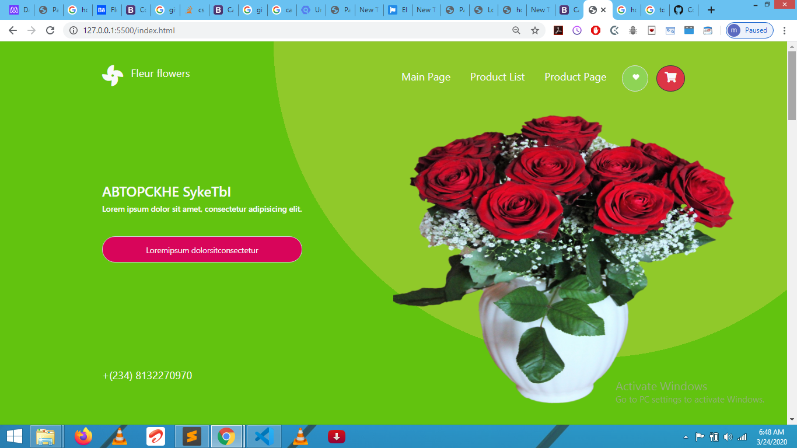

# HTML-CSS-CAPSTONE-PRO

 Responsive E-commerce style website(Capstone).

- It's a real-world-like project, built with business specifications.

A video review of this project by Morah Paul on [Loom-click-here]()

Additional description about the project and its features.

- The project contains the main page, with a menu link to the list of products page, the   list of products page, each product links to the product page, the product page.

- Each of these pages have versions for 2 different screen sizes: 
    - mobile & tablet: up to 1024px
    - desktop: from 1024px

Project anchor tags (links) are only simulations of what could be or would be a functional A tag (they are not meant to redirect only simulate.). 

> Note: Project was designed for screens of 320px width and above. 

## Built With

- HTML,
- Advance css
- Bootstrap 4

## Live Demo

[Live Demo Link](https://elated-hamilton-0166f1.netlify.com)

## Getting Started

To get a local copy up and running follow these simple example steps.

### Prerequisites
To make this repository working in your local machine you need only a browser.

## Author

👤 **Paul Chinweokwu Morah**

- Github: [@githubhandle](https://github.com/chinweokwu)
- Twitter: [@twitterhandle](https://twitter.com/Morah89820846)
- Linkedin: [linkedin](https://www.linkedin.com/in/paul-morah-285b63172/)

## 🤝 Contributing

Contributions, issues and feature requests are welcome!

Feel free to check the [issues page](https://github.com/chinweokwu/HTML-CSS-CAPSTONE-PRO/issues).

## Show your support

Give a ⭐️ if you like this project!

## Acknowledgments

a big hat to me and my partner mora and anyone who help us either by openning issues on this repository or reviewing our code :)

## 📝 License

This project is [MIT](lic.url) licensed.
